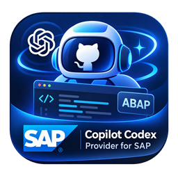

# Codex Copilot Manager for SAP

<p align="center">
  
</p>

一个本地 VS Code 扩展，把 Codex 作为两个彼此独立的 GitHub Copilot Chat 模型提供方，并通过标准 VS Code API 增强 ABAP FS 与 SAP ADT for VS Code 的上下文体验。

V1 明确不使用官方 OpenAI API、不要求 API key，也不连接 ADT MCP。

## 功能

- `Codex · ChatGPT OAuth`：扩展独立完成浏览器 OAuth PKCE 登录，token 仅保存在 VS Code SecretStorage，直接访问 ChatGPT Codex 私有后端。
- `Codex · Local CLI`：启动本机 `codex app-server --listen stdio://`，复用 Codex CLI 已有 ChatGPT 登录；扩展不会读取、复制或记录 `~/.codex/auth.json`。
- 两条 route 的认证、缓存、进程、错误与失败状态完全独立，不自动 fallback。
- Copilot 拥有工具审批与执行权；扩展只转发动态工具调用，不执行 shell、patch、SAP 写入或激活。
- Local route 保留 Copilot 的 required-tool 语义：required turn 必须至少调用一个本轮 supplied dynamic tool，不绑定某个固定工具名。
- 从活动编辑器、未保存选区、诊断和扩展注册表收集有界 SAP 上下文；不会递归扫描 `adt://`。

## 前置条件

- VS Code 1.125.0 或更高版本。
- GitHub Copilot Chat（用于模型选择、工具审批与执行）。
- 使用 OAuth route：可用的 ChatGPT 账号和浏览器。
- 使用 Local route：本机 Codex CLI/App Server，且已通过 Codex 自身完成 ChatGPT 登录。
- SAP 开发可选：ABAP FS `murbani.vscode-abap-remote-fs` 和 SAP ADT for VS Code `SAPSE.adt-vscode`。

## 安装 VSIX

1. 构建或取得 `dist/codex-copilot-provider-for-sap-0.2.1.vsix`。
2. 在 VS Code 执行 `Extensions: Install from VSIX...`。
3. 重载窗口。

```powershell
code --install-extension .\dist\codex-copilot-provider-for-sap-0.2.1.vsix
```

## 快速开始

1. 按 `Ctrl+Shift+P`，执行 `Codex Copilot Manager`。首次打开且尚未配置代理时，Manager 会先显示一次代理引导。
2. 使用 ChatGPT OAuth：选择 `Sign In with ChatGPT` 并完成浏览器登录；扩展会自动刷新模型，只有模型列表异常时才需要手动选择 `Refresh ChatGPT Models`。
3. 使用 Local CLI：先选择 `Select Local Codex Executable`，重载 VS Code，再选择 `Start Local Codex` 或 `Refresh Local Models`。
4. 打开 GitHub Copilot Chat，在模型选择器中选择 `Codex · ChatGPT OAuth` 或 `Codex · Local CLI` 下的具体模型。
5. 如需调整思考深度或 Fast 服务，在 Manager 中选择 `Open Settings`，修改 ChatGPT OAuth 设置；新设置从下一轮请求开始生效，无需重载。

Manager 还提供 ChatGPT 退出、Local Codex 重启/停止、SAP 代理绕过、诊断和扩展数据清理。底层命令 ID 继续注册用于兼容，但不会占满命令面板。

## ChatGPT OAuth route

1. 打开 `Codex Copilot Manager`，选择 `Sign In with ChatGPT`。
2. 阅读私有接口风险提示并确认。
3. 在浏览器完成登录。
4. 如果 loopback 回调没有自动完成，保持登录流程打开，在 Manager 中选择 `Complete ChatGPT Sign-In Manually`，粘贴完整 callback URL，不要编辑或裁剪。
5. 在 Manager 中选择 `Refresh ChatGPT Models`，或重新打开模型选择器。

回调仅监听 loopback 地址，并按顺序尝试端口 1455、1457。OAuth session 不与 Local route 或 Codex CLI 共享。

## 代理配置：Clash/Mihomo 与 SAP

首次打开 `Codex Copilot Manager` 且 `copilotCodex.chatgpt.proxyUrl` 为空时，扩展提供以下选择：

- `Configure ChatGPT-only proxy`：推荐用于 Clash/Mihomo，只代理 ChatGPT OAuth、token 刷新、模型发现和回复请求。
- `Use environment proxy`：保持扩展专用代理为空，使用 VS Code 进程继承的 `HTTP_PROXY`、`HTTPS_PROXY` 和 `NO_PROXY`。
- `Configure later`：不修改任何代理设置；之后可在 Manager 中选择 `Configure ChatGPT Proxy`。

Clash/Mihomo 使用 HTTP 或 Mixed 端口时，常见用户设置如下；端口必须以本机实际配置为准：

```jsonc
{
  "copilotCodex.chatgpt.proxyUrl": "http://127.0.0.1:7897",
  "http.noProxy": [
    "localhost",
    "127.0.0.1",
    "<sap-host>",
    "<sap-ip>"
  ]
}
```

`http.noProxy` 是 VS Code 的共享代理绕过设置。也可以在 Manager 选择 `Configure SAP Proxy Bypass`，输入逗号或换行分隔的 SAP 主机名/IP；扩展只会把新值合并到用户级 `http.noProxy`，保留并去重已有条目，然后提示重载。

扩展不会自动修改 Windows 系统代理、VS Code 全局 `http.proxy`、环境变量、`NO_PROXY`、ABAP FS 连接或 SAP ADT 连接。只有用户明确执行 `Configure SAP Proxy Bypass` 时才更新 `http.noProxy`。

ChatGPT 专用代理与 SAP 的边界：

- `copilotCodex.chatgpt.proxyUrl` 仅注入 ChatGPT OAuth route，显式配置时优先于继承的环境代理。
- Local CLI route 不读取该设置；它使用 Codex CLI/App Server 自身的网络环境。
- ABAP FS 和 SAP ADT 不读取 `copilotCodex.chatgpt.proxyUrl`。VS Code `http.noProxy` 可覆盖遵循 VS Code 共享代理层的请求，但不能保证覆盖它们启动的全部 Node/Java 子进程。
- 如果启用环境代理，应同时将 SAP 主机名/IP 加入系统/启动环境的 `NO_PROXY`，例如 `localhost,127.0.0.1,::1,<sap-host>,<sap-ip>`；SAP ADT 的独立 Java 进程还可能需要组织网络或 JVM 级绕过配置。不要在仓库或诊断中提交真实 SAP authority。
- 如果开启系统代理后 `adt://`、KIC 或 SAP 登录失败，优先关闭全局代理或补充 `NO_PROXY`，同时保留 ChatGPT 专用代理。
- Clash/Mihomo 必须将相同 SAP 主机配置为 `DIRECT`；`http.noProxy` 不会自动改写 Clash/Mihomo 规则或 Windows 系统代理绕过列表。
- 不要使用 `NODE_TLS_REJECT_UNAUTHORIZED=0` 解决代理或证书问题；它不会修复路由，并会禁用 TLS 证书校验。

## Local Codex CLI route

1. 在终端确认 `codex --version` 可用，并由 Codex CLI 自身完成 ChatGPT 登录。
2. 如果 `codex` 不在 PATH，在 `Codex Copilot Manager` 中选择 `Select Local Codex Executable`。
3. 重载 VS Code，使 executable 设置生效。
4. 在 Manager 中选择 `Start Local Codex`，或直接选择 Local 模型。
5. 可使用 Start、Restart、Stop、Refresh Local Models 管理该 route。

扩展固定使用 `codex app-server --listen stdio://`，不允许配置任意 App Server 参数或 shell command。App Server thread 使用 `approvalPolicy: never`、`sandbox: read-only`、ephemeral thread，并关闭 native command/file/web/browser/app/plugin/multi-agent 等能力。

## ABAP FS 与 SAP ADT

- 扩展只读取标准 VS Code `TextDocument`、`TextEditor`、diagnostics 和 extension registry。
- `adt://` URI 保持为 URI 字符串；不会转换为本地 `fsPath`，也不会通过 Node `fs` 读取远程对象。
- 未保存内容来自活动文档的选区；空选区不会附加整份源码。
- 默认选区上限 16,000 字符，诊断上限 50 条，最终 SAP instruction 有 64,000 字符硬上限。
- SAP instruction 只根据当前 Copilot 请求实际提供的工具识别 search/read/workspace URI/create/edit/diagnostics/activate 能力；该识别不会过滤或改写 supplied tools。
- 用户明确要求修改且本轮存在 write-capable tool 时，Codex 会通过 Copilot supplied tool 请求实际修改，必要时先解析 `adt://` workspace URI，并在可用时通过 read/diagnostic tool 验证结果。
- 本轮没有 write-capable supplied tool 时，Codex 不得声称修改已经完成。
- 扩展不会调用 SAP ADT 私有 exports、未公开 command、ADT MCP，也不会直接修改或激活 SAP 对象。

V1 的“深度支持”依赖 Copilot/VS Code 提供的标准工具和审批机制。SAP ADT 或 ABAP FS 未公开为 Copilot tool 的能力，扩展不会绕过其边界。

## 设置

| 设置 | 默认值 | 说明 |
|---|---:|---|
| `copilotCodex.local.codexPath` | 空 | Local Codex executable 的绝对路径；修改后需重载 VS Code |
| `copilotCodex.chatgpt.proxyUrl` | 空 | 仅用于 ChatGPT 登录令牌、模型发现和回复请求的 HTTP(S) 代理；修改后需重载 VS Code |
| `http.noProxy`（VS Code 内置） | 空数组 | VS Code 共享代理绕过主机；可通过 Manager 的 `Configure SAP Proxy Bypass` 合并配置，修改后需重载 |
| `copilotCodex.chatgpt.reasoningEffort` | modelDefault | ChatGPT OAuth 思考深度：`modelDefault`、`none`、`low`、`medium`、`high`、`xhigh` 或 `max`；下一轮请求立即生效 |
| `copilotCodex.chatgpt.speedMode` | modelDefault | ChatGPT OAuth 服务速度：`modelDefault` 或 `fast`；Fast 在私有后端请求中映射为 `priority` service tier，需要账号和模型支持，下一轮请求立即生效 |
| `copilotCodex.requestTimeoutSeconds` | 600 | HTTP/RPC 请求超时，最小 10 秒；修改后需重载 VS Code |
| `copilotCodex.toolTimeoutSeconds` | 300 | Copilot 工具 continuation 超时，最小 30 秒；修改后需重载 VS Code |
| `copilotCodex.catalogCacheMinutes` | 5 | 每条 route 独立模型目录缓存时间；修改后需重载 VS Code |
| `copilotCodex.sapSelectionMaxChars` | 16000 | 活动选区最大字符数 |
| `copilotCodex.logLevel` | info | `error`、`warn`、`info` 或 `debug` |

`modelDefault` 表示扩展不发送对应覆盖字段，由所选模型和 ChatGPT 后端决定默认值。用户设置仍使用 `fast`；扩展仅在协议层将其编码为私有后端接受的 `service_tier: priority`，这不会改变界面设置。两个设置只作用于 ChatGPT OAuth route，不改变 Local CLI。

没有 endpoint、token、Cookie、ADT token、App Server args 或 shell command 设置。

## 诊断与排错

打开 `Codex Copilot Manager` 并选择 `Show Diagnostics`。报告只包含版本、平台、provider 可用性、模型数/缓存年龄、用户名脱敏后的 executable、App Server 安全状态、SAP 扩展布尔值与安全错误码。Local tool lifecycle 日志只记录 tool mode/count、能力布尔值、tool name、状态和 pending count。

恢复动作包括 `signIn`、`refreshModels`、`selectCodex`、`restartCodex`、`upgradeCodex` 和 `showDiagnostics`。诊断和日志不应包含 token、账号邮箱、prompt、源码、工具 body、raw stderr 或 SAP system authority。

## 卸载与数据清理

先在 `Codex Copilot Manager` 中选择 `Clear Extension Data`，再卸载 VSIX。该操作只清除本扩展的 OAuth session/secret、两条 route 的模型缓存、continuation 状态、诊断与安全日志；不会注销 Codex App Server 账号、删除 Codex 配置或修改 SAP 连接。

卸载扩展不会删除 Codex CLI 自身管理的登录数据。

## 私有接口风险

ChatGPT OAuth route 使用未承诺稳定性的 ChatGPT Codex 私有接口，可能随服务端变化而失效。它不是官方 OpenAI API，也不应被当作官方 API 的兼容层。升级前请查看 `CHANGELOG.md`，并重新运行 `docs/testing.md` 中的验收矩阵。
